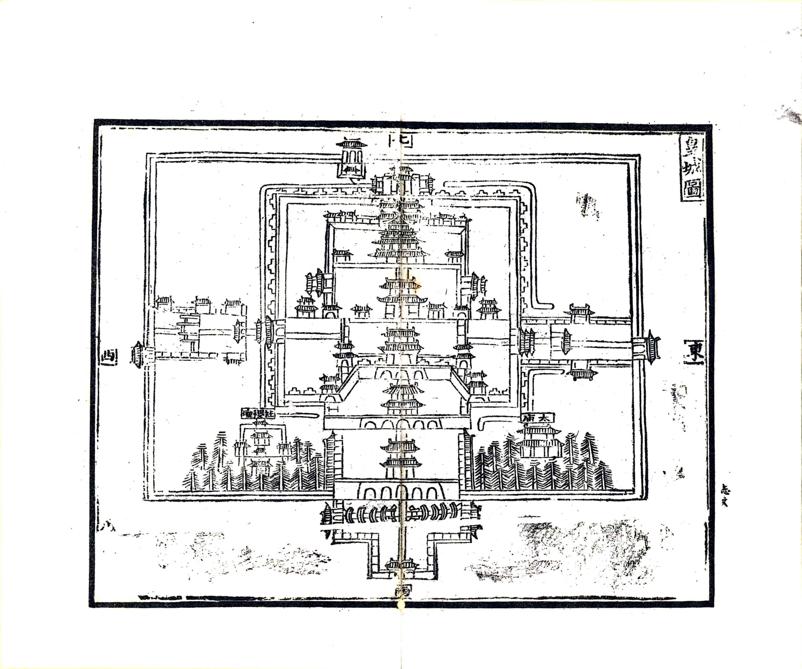
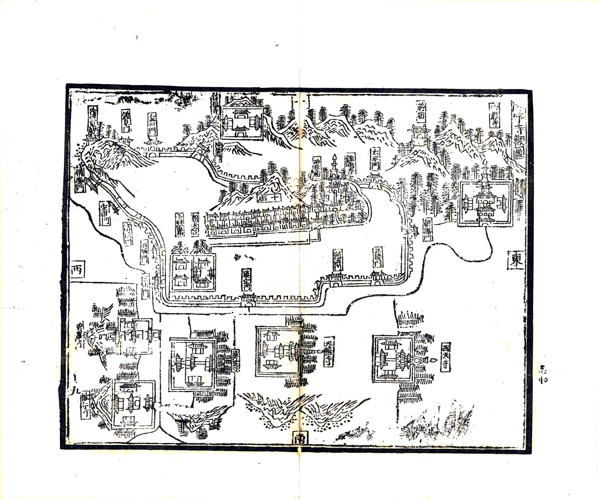
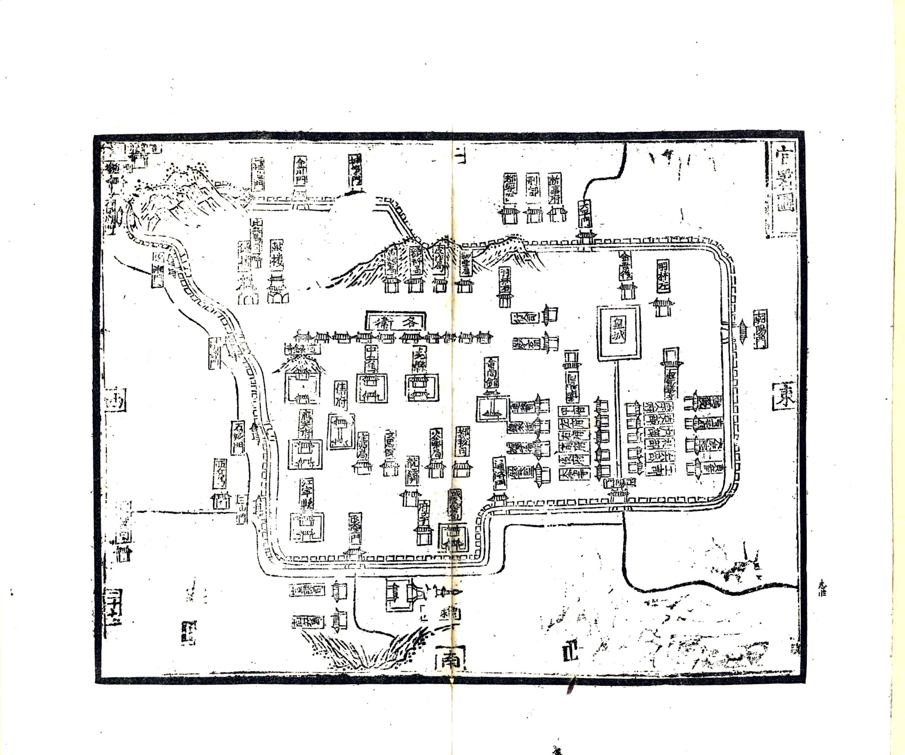
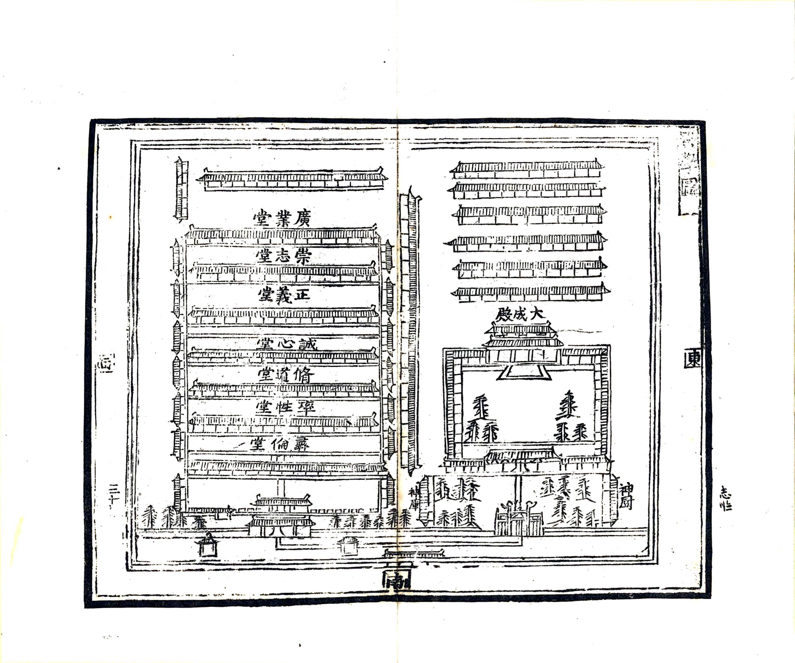
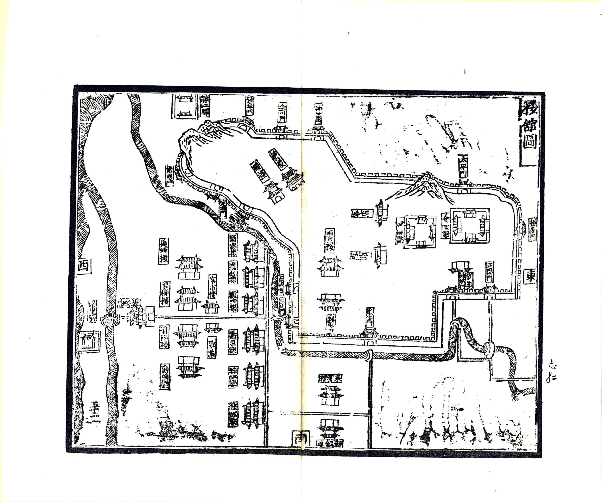

# 洪武京城图志（文字整理本）

> 据 1929 年扫叶山房石印本《洪武京城图志》影印件整理。原书为竖排右起，今改为横排左起，段落与条目仍依原书次第。图幅仅记其名，不录图像。

***

## 目 录

* 旧序

* 京城图

* 宫阙

* 城门

* 山川

* 寺观

* 祠庙

* 官署

* 学校

* 桥梁

* 街市

* 馆驿

* 楼馆

* 仓库

* 廐牧

* 园囿

* 后序

***

## 洪武京城图志序

### 杜泽 撰

昔者圣王之有天下也，建都立邑，所以谨封疆、定民志，非苟为高大壮丽以观美而已。必因地之宜，顺时之序，规模式廓，可传于永久。自五帝之前，世远难复；禹平水土，画为九州，列爵五等，各有分土。当时之制，弗可考已。至成周之世，咸有《职方》之书，辨其州域，正其封疆，有所谓国都、乡遂、稍甸、县鄙、畿疆之制，纤悉备具。历世寖远，典籍散逸，学者徒能诵其空言，而莫睹其制作之实。此后世有志于复古者，未尝不慨然于斯也。

我国家受天明命，圣人在御，建都金陵，定鼎开天，混一区宇。自五代以来，海分裂，几五百年，礼乐车书，至我朝而后复。诚千载一时之会，大有为之君，适当其可。皇上宵衣旰食，建万世不拔之基。凡庙祀之崇，宫阙之壮，城郭池濠之深，郊垌馆驿之侈，所以维持藩屏于亿万斯年者，无不曲尽其道。而又以为京师天下之本，不可无图志以示永永。洪武二十八年秋，诏礼部臣，以京城内外宫阙、城门、山川、祠庙、官署、街衢、楼馆、桥梁、教坊、仓库、厩牧、园囿，凡可以系于典故者，悉著于编，为图为志，俾览者开卷了然，如身到其地，目击其事，所谓一代之盛典，千载之伟观也。

泽以微陋，职忝太史，获预纂述之末，谨拜手稽首而为之序。

洪武二十八年冬十有二月，承直郎、詹事府丞臣杜泽谨序。

***

## 洪武京城图志记

皇上受天明命，起于濠梁，不阶尺土，戡定祸乱，华夷攸同。洪武元年，即皇帝位，定鼎金陵，奄有四海，以为宅中图大，万世之业。然而金陵自六朝以来，号为名都，其山川形胜，气势雄伟，诚足以为帝王之州。然而六朝偏霸，不能混一海内，以复中原。至于南宋，偏安江左，又不足以有为。我皇上神武不杀，顺天应人，不数年间，扫除群雄，民获其所。乃以六朝旧都，规模狭隘，不足以控制远方，遂拓其地，广其城，宫闱殿阙，郊坛庙社，莫不宏壮严丽，冠于前代。

洪武元年，改应天府为南京。十一年，改南京为京师。二十四年，改建大寿山。二十八年，诏礼部纂辑《洪武京城图志》，以传于世。

窃尝以为，自古建都之地，莫过于关中、洛阳、汴梁、金陵。然关中、洛阳，自五代以来，屡经兵燹，风景不殊，而人物凋耗。汴梁为宋故都，自金人之乱，宫阙为墟。惟金陵自六朝以来，素称繁丽，又为我皇上创业之地，规模宏远，气象光华，非六朝偏霸之所可拟。

观其山川环抱，形势雄固，长江天堑，足以为守；钟山龙蟠，石城虎踞，真帝王之宅也。而我皇上又能不事侈靡，惟务节俭，凡土木之工，皆出于不得已。其规画之详，规模之远，固已超出于前代矣。

呜呼，盛哉！后之览者，知我国家基业之宏，生民之庶，必有以见我皇上经营缔构之劳，而思所以善继善述也。谨记。

***

## 封域图考

### 山川考

建康之地，《禹贡》扬州之域。春秋时属吴，战国时属越，后属楚。秦为秣陵县，属会稽郡。汉为丹杨郡。吴大帝始建业都之，改秣陵为建业。晋平吴，改建业为建邺。元帝渡江，以为都，避愍帝讳，改改建康。宋、齐、梁、陈皆因之。隋平陈，诏并荡平，更为蒋州。唐为升州。五代时，吴据有其地，及南唐李氏，亦都之。

国朝定鼎，以建康为应天府。洪武元年，为南京。十一年，为京师。领县六：上元、江宁、句容、溧水、高淳、江浦。

其地东自镇江府丹阳县界，西至和州含山县界，南至宁国府宣城县界，北至扬州府江都县界。东西广一百九十五里，南北袤二百一十五里。

城周围九十六里，门十三：正南曰正阳，南之左曰通济，南之右曰聚宝，西南曰三山，西之南曰石城，西之北曰清凉，北之西曰太平，北之北曰神策，北之东曰钟阜，东之北曰太平，东之南曰朝阳。

***

## 皇城图

> 图中标注：奉天殿、华盖殿、谨身殿、文华殿、武英殿、奉天门、华盖门、谨身门、文楼、武楼、文渊阁、东角门、西角门、东华门、西华门、玄武门等。

***

## 宫阙

### 殿

奉天殿、华盖殿、谨身殿、文华殿、武英殿、奉天门、华盖门、谨身门、文楼、武楼、文渊阁。

### 门

东角门、西角门、东华门、西华门、玄武门、长安左门、长安右门、南门、北门、东上南门、西上南门、东上北门、西上北门、西安门、北安门、玄武门、北安门、亲蚕门。

***

## 城门

### 内城门

正阳门、通济门、聚宝门、三山门、石城门、清凉门、定淮门、仪凤门、钟阜门、神策门、太平门、朝阳门。

### 外城门

上方、凤台、大驯象、小驯象、大安德、小安德、江东、佛宁、观音、上元、姚坊、仙鹤、麒麟。

***

## 山川

### 钟山

一名蒋山，在城东北，周围六十里，高一百五十八丈，东接青龙山，西接青溪。南有钟浦，下入秦淮，北接雉亭山。汉末有秣陵尉蒋子文逐盗死于此，吴大帝为立庙，封曰蒋侯。太祖讳钟，因改曰神烈山。

### 石头山

按《舆地志》，环七里，缘大江，南抵秦淮。山上有城，因以为名。吴孙权修理，因改曰石头城。今城于其上，甃以砖石，雄壮险固，甚得控制之胜。

### 覆舟山

一名龙山，一名龙舟山，在今太平门内。教场北周回三里，高三十一丈。北临玄武湖，状如覆舟。宋武帝又改名玄武山。

### 鸡鸣山

旧名鸡笼山，在覆舟山西，周回十余里，高三十丈。状如鸡笼，因名。今改鸡鸣山。

### 石灰山

在城西北三十里，周回三十里，高十丈。晋元帝渡江，王导建幕府于此，旧名幕府山。山上有虎跑泉、仙人台。

### 狮子山

在仪凤门北，与马鞍山接，周回十余里，高三十丈。又名卢龙山。国朝以其形名之。

### 马鞍山

在清凉门，与石头城接，西临大江，高十五丈，以形似得名。

### 青龙山

在城东南二十余里，周回二十里，高九十丈。

### 方山

一名天印山，在城东南三十里，周回二十余里，高一百二十六丈。四面正如印。

### 聚宝山

在聚宝门外，雨花台侧，上多细玛瑙石，因名聚宝山。金置钦天回回监于此。

### 牛首山

旧名牛头山，状如牛头，因名。周回四十余里，高一百四十丈。一名天阙山。中有石窟，不测浅深。在西南二十里，刘宋南郊坛在焉。

### 三山

在城西南四十余里，旧三石山。周回四里，三峰连出大江东岸，高二十余丈。吴津济道也。太白诗云「三山半落青天外」，即是。

### 大江

自京城西南来，经西北，东流入海。

### 秦淮

旧传秦始皇时望气者言金陵有天子气，东游以厌当之，凿方山断垄为渎，入江，故曰秦淮。

### 玄武湖

亦名蒋陵湖、秣陵湖，在太平门外。周回四十里。晋元帝所浚，以习舟师。又名后湖。宋元嘉中有黑龙见，因改玄武湖。有沟西入于秦淮。

### 太子湖

一名西池，吴宣明太子所浚。晋明帝为太子，修西池，多养武士，于内筑土为台。时人呼为太子西池。梁昭明太子植莲于此。

### 稳船湖

在佛宁门外。国朝新开通江水，于此泊舟，以避风涛。

***

## 寺观

> 图中标注天界寺、能仁寺、朝天宫、观音寺、净海寺、普德寺、报恩寺、鸡鸣寺等。

***

## 祠庙

### 天地坛

在正阳门外，山川坛东。按古南北二郊分祭扫地，以行事。国初尝因之，风雨寒暑，屡致弗调。皇上断自宸衷，以王者父天母地，无异祭之理，乃合祭于大祀殿，而祭配以仁祖淳皇帝。严以殿宇，左右列坛，以日月星辰、岳镇、海渎、风云雷雨山川，太岁历代帝王，天下神祇。

### 太庙

在端门之左。

### 社稷坛

在端门之右。旧分祭，有乖礼意者多。皇上历考古制，互有不同，以为五土五谷所以养夫民者也。分而祭之，生物之意若无所统。于是合祭于春祈秋报，岁率百官诣焉。

### 山川坛

在正阳门外，天地坛西。

### 帝王庙

国朝新建，在金川门外。凡行幸出师，亲王之国，则祀于此。

### 城隍庙

南唐在城西北，元在大街。国朝初建斗门桥东，今在鸡鸣山南。

### 真武庙

宋太平兴国二年置，在清化寺东，今徙鸡鸣山南。

### 卞壶庙

即卞将军庙。旧在朝天宫西冶城。晋苏峻之乱，尚书令卞壶与其二子眕盱死之，时人谓忠孝萃于一门。南唐保大中，始建忠贞亭于其墓北。宋庆历中改亭曰忠烈。

### 蒋忠烈庙

旧在蒋山之西北。神蒋子文，汉秣陵尉。逐盗至钟山，为贼所伤而死，为神。其有异迹在人，吴大帝为立庙，历代皆祀之。

### 刘越公庙

旧在上元县东，相传南唐刘仁瞻庙也。

### 曹武惠王庙

旧在聚宝门外。王讳彬，谥武惠。宋开宝中统兵平江南，不杀一人，邦人感之，为立祠。

### 功臣庙

国朝建鸡鸣山南。凡本朝开国元勋，在社稷功及生民者，则祀于此。

### 五显庙

今建在鸡鸣山。

### 关羽庙

旧在针工坊。宋庆元年间建，今徙鸡鸣山南。

### 徐将军庙

在狮子山。

### 晏公庙

在定淮门外。

### 无祀鬼神坛

在神策门外。

***

## 官署

> 图中标注宗人府、六部、都察院、五军都督府、应天府、上元县、江宁县等。

### 文职

宗人府、六部（吏部、户部、礼部、兵部、刑部、工部）、都察院、通政司、大理寺、詹事府、翰林院、光禄寺、太常寺、太仆寺、鸿胪寺、国子监、钦天监、太医院、文思院、织染局、铸印局、僧录司、道录司、教坊司、行人司、会同馆、乌蛮驿、龙江驿、江东驿、递运所、批验所、河泊所、税课司、司牲司、牛羊司、抽分场。

### 武职

五军都督府（中军、左军、右军、前军、后军都督府）、留守五卫、京卫、亲军指挥使司、十三卫、各卫指挥使司。

***

## 学校

### 国子监

在府治东。本朝洪武十五年改建。

### 应天府学

在府治西北。

### 上元县学

在县治东南。

### 江宁县学

在县治西南。

***

## 桥梁

大中桥、淮清桥、镇淮桥、浮桥、上清河、龙江桥、石城桥、旧桥、青溪桥、天津桥、上陡门、下陡门、笳桥、网头桥、柏树桥、北门桥、珍珠桥、陡门桥、走马桥、常府桥、四象桥、西虹桥、夹冈桥、栅栏桥、斗门桥、草桥、严家桥、明御桥、玉带桥、网头桥、三山洞、上坊桥、下坊桥。

***

## 街市

### 街

三山街、大中街、朱婆街、旧在城街、武定街、织锦街、长乐街、门北街、鸡鸣街、珠市街、下街、土街、清市街、上新河、中新河、下新河。

### 市

大中街市、三山街市、新桥市、聚宝门市、江东市、龙江市、钞库街市。

***

## 馆驿

### 馆

会同馆、乌蛮驿、龙江驿、江东驿。

### 驿

在上元县、江宁县各有驿递。

***

## 楼馆

> 图中标注赏心楼、醉仙楼、集贤楼、乐民楼、鹤鸣楼、清江楼、石城楼等。

### 楼

赏心楼、醉仙楼、集贤楼、乐民楼、鹤鸣楼、清江楼、石城楼、泼汉楼、镇淮楼、镇江楼、鼓楼、钟楼、观象楼、襟湖楼、镇海楼、三山寺楼、贡院楼、宗濂精舍、观象台、三官堂、真武庙、王姑祠、刘官人祠、郭甫君祠、刘公庙、宗鲁祠、徐仙祠、刘丞相信国公祠、普济堂、富乐院、养济院、漏泽园。

***

## 仓库

### 仓

大府仓、太平仓、镇淮仓、军储仓、预备仓、长盈仓、丰备仓、万亿仓、神策门仓、金川门仓、清凉门仓。

### 库

军储库、备库、皮作库、织染库、军器局、鞍辔局、军器局。

***

## 厩牧

### 马牧

在太平门外。

### 牛头牧

在安德门外。

***

## 园囿

### 园

东园、西苑、后苑、园林园、藏春园、乌馒园、雅园、暗园。

***

## 后序

### 王鸿儒 撰

《洪武京城图志》者，纪我太祖高皇帝定鼎金陵、经营建都之书也。初，工部侍郎黄臣等奉命编辑，未及成书。至洪武二十八年，始命礼部尚书任亨泰、国子监祭酒胡季安，取南京内外宫阙、城门、山川、祠庙、官署、街市、桥梁、楼馆、仓库、园囿，凡百庶务，悉编次之，为图为志，凡若干卷。

仁宗昭皇帝在东宫时，尝命缮写以进。及今上皇帝嗣服，万几之暇，阅其书而善之，谓京师天下之本，不可不传于后人。乃命重加校勘，镂板以广其传。

窃惟自古帝王建都，皆有所因。尧都平阳，舜都蒲坂，禹都平阳，汤都亳，武王都镐。其地皆有山川之险，城郭之固，风俗之美，人物之众。然而历世既久，往往泯灭。至于我朝，实应天命，为万世开太平之基。其规模之宏远，气象之光华，真所谓超乎千载之上，而立于百王之表者也。

是书也，其山川之险易，宫阙之广狭，街市之繁庶，与夫祠庙、官署、桥梁、仓库之详，皆可按图而考。后之览者，知我国家基业之重，根本之固，而思所以善继善述于无穷，岂不伟欤！

时正德八年春二月吉日，奉训大夫、南京工部主事、洛阳江瀚书。

***

## 题后

### 归有光 撰

《京城图志》一卷，洪武闲奉敕纂修。故乡贡进士吴中英家藏辛卯岁某年赴试京闱，中英以见示。今二十有九年矣。偶阅元御史台所纂《金陵志》，念令市朝改易，无复六朝江左之旧。因从吴氏再借此本观之，信分裂偏安之迹，与混一全盛之规，抚卷迥别如此。自永乐移鼎，儒臣附会，以为高皇帝无再世之计也。尝伏读《御制阅江楼记》云：「自禹之后，四方之形势，有过中原而不都者，盖天地生气运循环而未周。朕当天地循环之初气，创基于此，非古之金陵亦非六朝之建业也。道里之均，万邦之贡，顺水而趋公私，不乏利亦久矣。夫帝王所为，与天地应高皇帝之论，盖度越千古，直有所谓配皇之至祀上下自时。中天之意，愚生自谓独能藕知之。与时俗所论建都者不同，因特著于此。」

昆山归有光记。

***

## 跋

### 朱绪曾 撰

《洪武京城图志》，明洪武时礼部奉敕所撰。凡图十三，六朝南都规模，约具于是。明祖定鼎金陵，虽上承六朝南唐之绪，然规恢宏伟，远非前代所可同日而语。北拓仪凤门，西包乌龙潭，固已迥轶杨李。其外罗城周回可二百余里，包钟山孝陵其中，往迹具在，可以复按宇内之所未有也。成贤街之国学，养士达万人，钟山之阳，建漆园、桐园、棕园，广植各树，晚近兴学造林，咸不出其遗址。是则太祖之闳识，尤不可及矣。是书具载楼馆街市、坛庙官署所在，不惟治史者得以擘索明都，即今日经营建设，亦宜研阅以识前人之伟大。知所自势不必病其盐于政体也，惟是书所志仅具梗概，世有好学深思之士，为之句稽故籍详加注释，则徐星伯两京城坊，攷不得专美于前矣。此本为八千卷楼旧藏，明弘治中王鸿儒翻雕本，述之朱氏盛称洪武本，顾在明时即已罕觏，则兹翻刊亦可珍也。归震川集开有《益斋读书志》善本书室藏书志，均有跋用，附卷末以备览。观戊辰冬十有二月，镇江柳诒征跋。

***

> **整理说明**
> ：以上文字系据 1929 年扫叶山房石印本逐页识读整理。原书为木刻竖排，字迹多有漫漶，部分条目文字难以完全确认，整理时酌加校补。五幅古图（皇城图、寺观图、官署图、学庙图、楼馆图）已从原书 PDF 中提取高清图幅，插入对应章节。